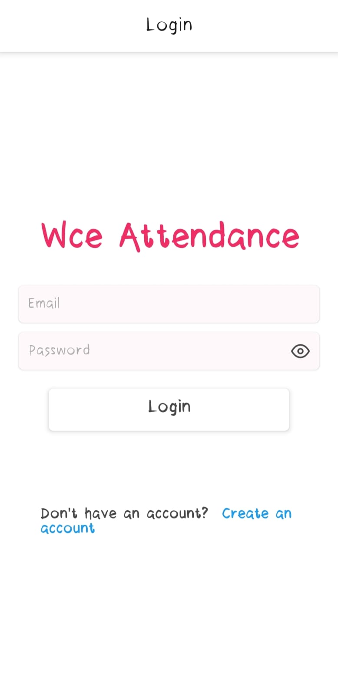
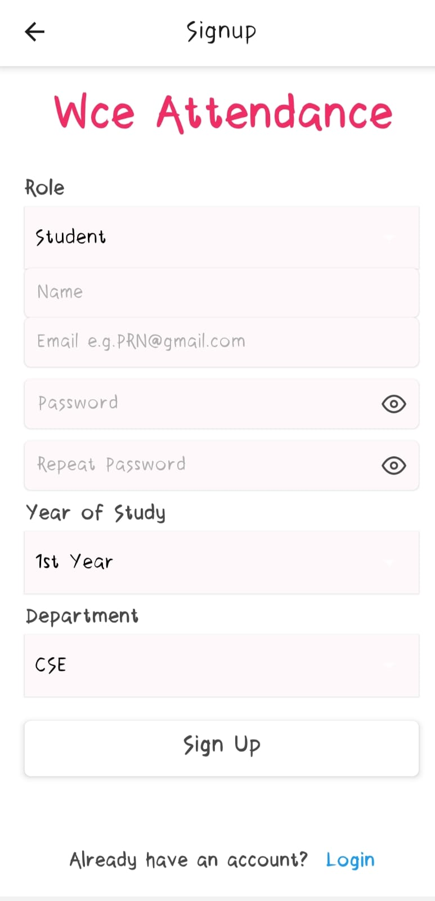
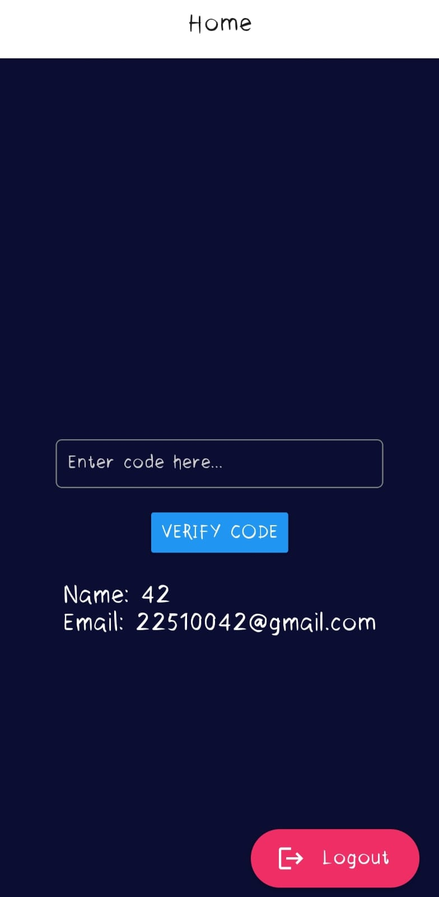
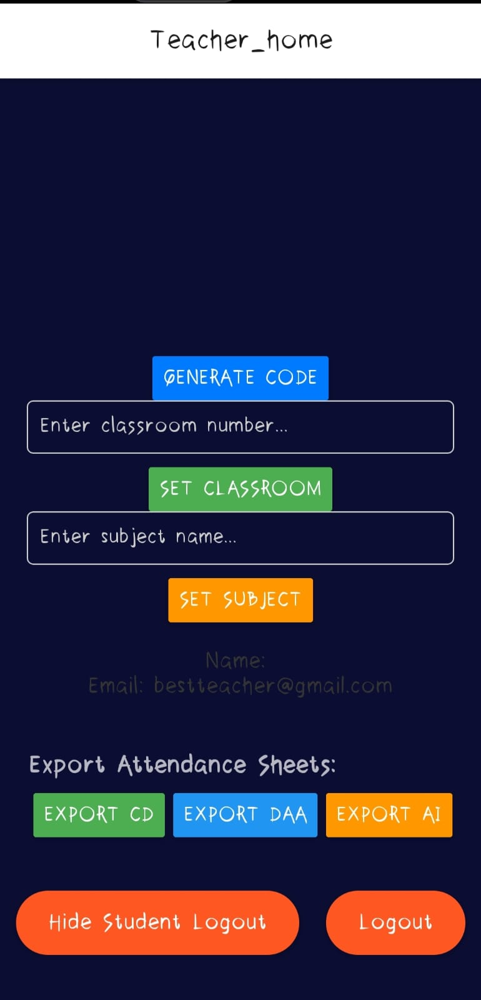

# Attendify

**A Secure Classroom Attendance System Using GPS and Biometric Authentication**

---

## Table of Contents

1. [Introduction](#introduction)
2. [Features](#features)
3. [Technical Overview](#technical-overview)
4. [Installation Guide](#installation-guide)
5. [How It Works](#how-it-works)
6. [System Architecture](#system-architecture)
7. [UML Diagrams](#uml-diagrams)
8. [Future Scope](#future-scope)
9. [Project Plan](#project-plan)
10. [Contributors](#contributors)
11. [References](#references)
12. [License](#license)

---

## Introduction

Attendify is an innovative solution for educational institutions to automate and secure the attendance process. By utilizing **GPS-based location verification** and **biometric fingerprint authentication**, Attendify ensures that only students who are physically present in the classroom can mark their attendance.

The app eliminates fraudulent attendance practices, reduces manual work, and creates a more reliable and user-friendly experience for teachers and students.

---

## Features

- **Two-Step Verification**:
  - **GPS Verification**: Confirms that the student is within the classroom's predefined coordinates.
  - **Biometric Fingerprint Authentication**: Validates the student's identity using a secure fingerprint match.

- **Teacher-Generated Code**:
  - A session-based code provided by the teacher ensures attendance is specific to a lecture.

- **Secure Data Handling**:
  - Cryptographic key management to protect sensitive data.
  - End-to-end encryption for all stored and transmitted data.

- **Cross-Platform Support**:
  - Mobile application built using React Native to support both Android and iOS devices.

- **Scalable Backend**:
  - A Node.js-based backend with MongoDB for efficient data storage and retrieval.

---

## Technical Overview

### Tech Stack

- **Frontend**: React Native
- **Backend**: Node.js with Express
- **Database**: MongoDB
- **APIs**:
  - GPS: Geolocation API
  - Biometric Authentication:
    - Android: BiometricPrompt
    - iOS: LocalAuthentication
- **Security**: Cryptographic key generation and management
- **Version Control**: GitHub

### Algorithms
- **GPS Location Verification**:
  - Polygon-based geofencing to determine if the user is within the classroom coordinates.
- **Biometric Key Matching**:
  - Cryptographic key generation and fingerprint validation to ensure secure authentication.

---

## Screenshots

### Login Screen

### Registration Screen

### Student Dashboard

### Teacher Dashboard

---
